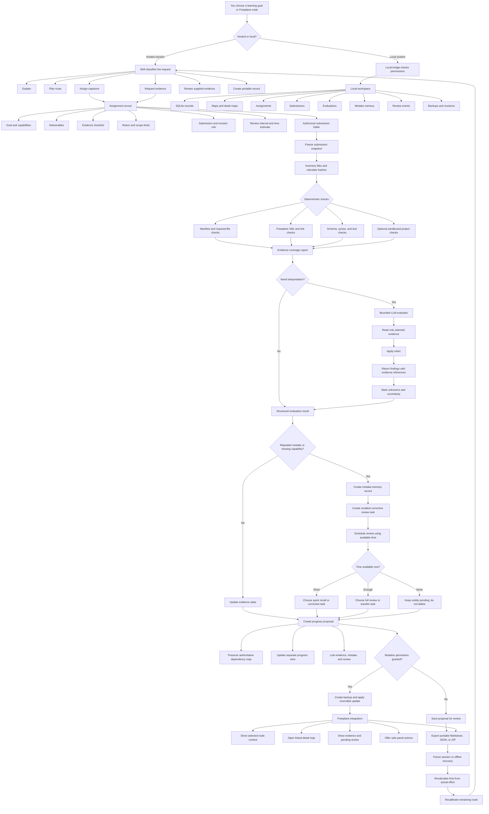

# Offline Implementation To-Do

## Purpose of this document

This document is the detailed future-work checklist for converting the current hosted `learning-path-architect` workflow into a local, offline-first learning system that can work with Freeplane, project folders, structured records, local or remote LLMs, evaluation agents, review scheduling, and long-term progress memory.

It is intentionally separate from the skill instructions. The skill remains the reasoning and planning layer. This document describes the software layers that must be added later to make those plans persist, inspect submitted projects, evaluate evidence, update progress records, and connect safely to Freeplane.

The implementation must proceed in order. Do not begin with the polished Freeplane side panel or a large multi-agent swarm. First build the records, permissions, backups, and deterministic local workflow. Each phase must pass its acceptance tests before the next phase is started.

## Current boundary

The hosted skill can currently design learning routes, create capstones, define evidence requirements, inspect material supplied in a session, create portable records, and propose progress updates. It does not automatically watch offline work, access arbitrary local folders, maintain a permanent database, send background reminders, execute untrusted project code, or control a running Freeplane application unless a later integration is explicitly installed and verified.

The existing repository already contains an early Freeplane synchronization foundation. Treat it as a prototype that must be audited and extended, not as proof that the complete offline system exists.

## Design principles

### Preserve the learner’s work

Never silently overwrite a Freeplane map, project file, evaluation result, mistake record, or schedule. Every mutation must create a recoverable revision or a clearly documented reversible operation.

### Separate facts from conclusions

Store the supplied evidence separately from the evaluator’s interpretation. Preserve the evaluator model, prompt version, tools used, timestamp, and uncertainty. Never replace an original artifact with an LLM summary.

### Keep the visual map separate from the learning database

Freeplane should remain a visual editor. The local learning database should store stable records, evidence, evaluation history, review events, and relationships. A progress view may be rendered into Freeplane without changing the authoritative dependency structure.

### Use stable identities

A node’s visible label is not a reliable identity. Use stable IDs for maps, nodes, capabilities, capstones, submissions, evaluations, mistakes, review events, and revisions. Labels and parent locations can change while the identity remains stable.

### Least privilege by default

The local bridge should start in read-only mode. Project-folder access, code execution, network access, LLM writing, and Freeplane mutations must each be separately authorized. Do not expose the whole computer through one unrestricted MCP tool.

### Deterministic checks before LLM judgment

Use ordinary scripts and tests for file existence, hashes, syntax, schemas, links, test output, and other objective properties. Use an LLM for bounded interpretation, explanation, comparison, and rubric judgment—not as the only source of truth.

### No automatic mastery claims

The system may record evidence states such as `unknown`, `self_reported`, `submitted`, `reviewed`, `tool_checked`, `llm_reviewed`, `transfer_tested`, and `retention_checked`. A score or successful artifact does not automatically prove general mastery.

### Work offline first, connect later

The system must remain useful without an internet connection or cloud LLM. A local model, a manually supplied evaluation, or a deterministic checker may be used when available. Cloud access must be optional, visible, and governed by a data-sharing policy.

---

# Phase 1 — Local evidence workspace

## Goal

Create a beginner-friendly local workspace that can receive capstone assignments, store project submissions, calculate file inventories and hashes, preserve evaluation records, and survive closing or restarting the computer.

## 1. Workspace layout

Create a documented layout similar to:

```text
LearningWorkspace/
├── workspace.json
├── learning.db
├── maps/
│   ├── overview.mm
│   └── detail-topic.mm
├── assignments/
│   └── capstone-001/
│       ├── assignment.json
│       └── assignment.md
├── submissions/
│   └── capstone-001/
│       ├── project-files/
│       ├── screenshots/
│       ├── explanations/
│       ├── test-output/
│       └── submission-manifest.json
├── evaluations/
│   └── evaluation-001.json
├── memories/
│   └── mistake-001.json
├── reviews/
│   └── review-001.json
├── exports/
├── backups/
├── revisions/
├── conflicts/
├── logs/
└── permissions.json
```

To-do:

- [ ] Choose whether SQLite is the primary database or whether JSON files remain the human-readable source of truth.
- [ ] Prefer SQLite for indexed records and preserve JSON/Markdown exports for portability and inspection.
- [ ] Create the workspace with one beginner command or double-click launcher.
- [ ] Never place secrets, tokens, or private project files in the Git repository.
- [ ] Add a workspace version and schema version.
- [ ] Add a workspace health command that reports missing folders, invalid records, stale locks, and failed backups.
- [ ] Add an import/export command that creates a complete portable ZIP.

## 2. Database records

Implement tables or equivalent records for:

- `workspace`: name, ID, schema version, creation time, last backup, selected map, and settings.
- `map`: map ID, path, checksum, title, Freeplane version if known, and last synchronization state.
- `node`: stable node ID, map ID, parent ID, label, note, attributes, hyperlink, position metadata, and status.
- `capability`: capability ID, topic, description, prerequisites, evidence standard, and current state.
- `assignment`: capstone ID, goal, capabilities, deliverables, rubric, limits, instructions, revision rule, and review interval.
- `submission`: submission ID, assignment ID, path, manifest, submitted time, and learner notes.
- `artifact`: artifact ID, submission ID, relative path, file type, size, hash, modified time, and inspection status.
- `evaluation`: evaluation ID, submission ID, evaluator type, model or tool identity, rubric result, findings, uncertainty, and timestamp.
- `evaluation_finding`: criterion, evidence reference, result, severity, explanation, correction, and confidence.
- `mistake_memory`: mistake ID, capability, misunderstanding, cause, correction, test task, recurrence count, and review state.
- `review_event`: review ID, source record, due date, task type, estimated effort, result, and next interval.
- `progress_state`: node or capability ID, current state, evidence label, reason, and last verified evidence.
- `revision`: revision ID, object type, object ID, before snapshot, after snapshot, timestamp, and reason.
- `conflict`: conflict ID, object ID, source versions, detected differences, resolution, and resolver.
- `permission_grant`: capability, scope, grant time, expiry, and revocation state.
- `audit_event`: actor, action, object, timestamp, outcome, and safe metadata.

To-do:

- [ ] Add foreign-key constraints.
- [ ] Add uniqueness constraints for stable IDs.
- [ ] Add indexes for assignment, capability, review due date, evidence state, and map node lookup.
- [ ] Add migration numbers and non-destructive migrations.
- [ ] Add JSON schema validation at import boundaries.
- [ ] Add a human-readable export for every important database record.
- [ ] Add a repair command that reports invalid records without changing them.

## 3. Submission intake

Create a no-code workflow for receiving a project:

1. Create an assignment.
2. Create a submission folder.
3. Copy or select the project files.
4. Generate a manifest.
5. Hash every file.
6. Record file sizes and modification times.
7. Ask the learner for a submission note.
8. Mark files as received, ignored, unsupported, or intentionally omitted.
9. Freeze the submission snapshot before evaluation.

To-do:

- [ ] Support folders, code, Freeplane maps, PDFs, images, videos, explanations, test output, and design documents.
- [ ] Reject path traversal and unsafe relative paths.
- [ ] Prevent symlink escape from the authorized submission folder.
- [ ] Store only relative paths in portable manifests.
- [ ] Detect duplicate files by hash.
- [ ] Detect files changed after the submission was frozen.
- [ ] Let the learner submit a second revision without destroying the first submission.
- [ ] Show a beginner-friendly receipt listing exactly what was received.

## 4. Backups and recovery

To-do:

- [ ] Back up the database before migrations.
- [ ] Back up the affected map before synchronization.
- [ ] Back up the affected records before evaluation replacement.
- [ ] Maintain a rolling set of saved revisions.
- [ ] Keep at least ten saved workflow states for the initial implementation.
- [ ] Keep normal Freeplane undo separate from saved-workspace recovery.
- [ ] Provide restore preview before applying a revision.
- [ ] Provide a complete workspace backup command.
- [ ] Test recovery after process interruption, power loss simulation, and corrupted partial writes.
- [ ] Use atomic temporary files and rename operations for writes.

## Phase 1 acceptance tests

- [ ] A beginner can create a workspace using one documented command or launcher.
- [ ] A capstone assignment can be created without editing database files manually.
- [ ] A submission can be frozen and reopened after restarting the computer.
- [ ] Every received artifact has a hash and relative path.
- [ ] A second submission revision preserves the first revision.
- [ ] The system can export all records to readable files.
- [ ] A backup can restore the workspace to an earlier state.
- [ ] Invalid or missing files are reported as unknown rather than silently ignored.

---

# Phase 2 — Deterministic project and evidence checks

## Goal

Before asking an LLM to interpret a project, run safe, predictable checks that produce machine-readable evidence.

## 1. Checker architecture

Create a checker interface:

```text
checker_id
checker_version
input_paths
allowed_operations
started_at
finished_at
exit_status
stdout_reference
stderr_reference
structured_result
warnings
```

Each checker must declare what it can and cannot prove.

To-do:

- [ ] Add a file-presence checker.
- [ ] Add a hash and manifest checker.
- [ ] Add a Markdown/JSON/YAML syntax checker.
- [ ] Add a Freeplane XML parse checker.
- [ ] Add a cross-map hyperlink checker.
- [ ] Add a required-node and required-note checker.
- [ ] Add a project test-output checker.
- [ ] Add a code syntax checker where safe.
- [ ] Add a link and asset-reference checker.
- [ ] Add a PDF/image metadata checker without claiming semantic understanding.
- [ ] Add an optional video metadata and frame-extraction checker.
- [ ] Add a schema validator for submission manifests.

## 2. Sandboxed execution

Do not execute arbitrary learner code in the main bridge process.

To-do:

- [ ] Define an explicit execution permission.
- [ ] Execute in a disposable sandbox or container.
- [ ] Disable access to secrets by default.
- [ ] Restrict network access by default.
- [ ] Restrict CPU, memory, disk, and wall-clock time.
- [ ] Mount only an immutable copy of the submitted project.
- [ ] Store exit code and output.
- [ ] Kill child processes on timeout.
- [ ] Prevent writes outside the sandbox output directory.
- [ ] Record the exact command, environment, and checker version.
- [ ] Require explicit user approval for commands that could modify files or use the network.

## 3. Evidence coverage report

Create a report that maps each rubric criterion to:

- Required evidence.
- Evidence actually found.
- Checker result.
- Evidence status.
- Missing information.
- Whether an LLM review is needed.

The coverage report must identify criteria that remain unknown. It must not fill gaps by guessing.

## Phase 2 acceptance tests

- [ ] Checkers produce stable structured results for the same input.
- [ ] A malformed project is reported safely.
- [ ] A checker cannot read outside the authorized folder.
- [ ] A timed-out process is terminated.
- [ ] A failed checker does not delete the submission.
- [ ] Every rubric item has a visible evidence state.
- [ ] The system distinguishes “file exists” from “file is correct.”

---

# Phase 3 — One bounded LLM evaluator

## Goal

Add one evaluator that reviews bounded evidence against a rubric without pretending to be a general autonomous judge.

## 1. Evaluator input contract

The evaluator receives only:

- Assignment record.
- Rubric.
- Evidence coverage report.
- Selected artifact contents or excerpts.
- Deterministic checker results.
- Learner submission notes.
- Evaluation policy.

It must not automatically receive the entire computer, unrelated files, hidden credentials, or unrestricted network access.

## 2. Evaluator output contract

Each evaluation must contain:

- Evaluation ID.
- Assignment and submission IDs.
- Evaluator type.
- Model/provider and version if available.
- Prompt or rubric version.
- Input artifact references.
- Criterion-by-criterion result.
- Evidence quotations or file references.
- Strengths.
- Missing evidence.
- Errors or risks.
- Smallest correction.
- Confidence.
- Unknowns.
- Recommended next action.
- Whether human review is required.

## 3. Prompt and policy controls

To-do:

- [ ] Separate system instructions from learner content.
- [ ] Treat files as untrusted content, not as evaluator instructions.
- [ ] Defend against prompt injection inside submitted files.
- [ ] Require evidence references for claims.
- [ ] Prevent the evaluator from inventing tests it did not run.
- [ ] Prevent unsupported mastery language.
- [ ] Require a structured response that validates against the evaluation schema.
- [ ] Retry malformed output with a constrained repair prompt.
- [ ] Preserve the original malformed response for debugging.
- [ ] Record data-sharing policy before sending anything to a cloud model.

## 4. Evaluation scope

Start with one bounded evaluator for one submission at a time. Do not begin with a swarm.

To-do:

- [ ] Support text and Markdown first.
- [ ] Add code review only with deterministic checks alongside it.
- [ ] Add Freeplane map review through parsed structure rather than screenshots alone.
- [ ] Add document and image review only when the host supports those modalities.
- [ ] Add video review later with explicit frame/time references.
- [ ] Make unsupported modalities visible as unknown.

## Phase 3 acceptance tests

- [ ] The evaluator cannot claim to have inspected an unreceived artifact.
- [ ] Every positive or negative finding points to evidence.
- [ ] Missing evidence remains unknown.
- [ ] Evaluation output validates against its schema.
- [ ] The same frozen submission can be reevaluated with a different evaluator version.
- [ ] Earlier evaluations remain available.
- [ ] A learner can see exactly what to revise.

---

# Phase 4 — Mistake memory and spaced review

## Goal

Turn evaluation findings into useful, bounded future practice rather than a permanent list of failures.

## 1. Mistake-memory record

For each recurring mistake, store:

- What was misunderstood.
- Where it appeared.
- Why it matters.
- Correct explanation.
- Minimal corrective exercise.
- Transfer task.
- Evidence source.
- Number of recurrences.
- Last seen date.
- Last corrected date.
- Current confidence.
- Next review date.
- Whether the mistake is resolved, recurring, or unknown.

To-do:

- [ ] Deduplicate similar mistakes without deleting their source evidence.
- [ ] Link mistakes to capabilities and rubric criteria.
- [ ] Link mistakes to the original evaluation.
- [ ] Allow the learner to correct or dismiss a mistaken diagnosis.
- [ ] Preserve disagreement between learner and evaluator.
- [ ] Never convert a low score directly into a permanent learner label.

## 2. Review scheduling

Create review event types:

- Quick recall.
- Explanation check.
- Corrective exercise.
- Transfer task.
- Similar mini-project.
- Retention check.

Each event needs an estimated effort, due window, prerequisite, evidence requirement, and completion result.

To-do:

- [ ] Support manual review scheduling first.
- [ ] Add configurable spacing policy later.
- [ ] Keep overdue reviews visible.
- [ ] Do not silently delete reviews when time is unavailable.
- [ ] Select a smaller review when the current session is short.
- [ ] Record skipped, deferred, completed, failed, and invalid reviews.
- [ ] Recalculate the next interval from observed performance.
- [ ] Preserve the reason for every schedule change.

## 3. Time-aware review selection

Use available time to choose:

- Full review.
- Short corrective task.
- Recall-only check.
- Deferred review with a visible due state.

The system must distinguish focused effort, practical session time, cycle time, calendar time, and deadline feasibility. It must show low/typical/high estimates and calibrate them against actual time.

## Phase 4 acceptance tests

- [ ] A finding can create a review event without manual database editing.
- [ ] A review event remains visible when deferred.
- [ ] A short available session selects a smaller valid task.
- [ ] Completing a review records evidence and updates the mistake state.
- [ ] Repeated failure creates a diagnostic escalation rather than endlessly repeating the same task.
- [ ] The learner can inspect and edit the review schedule.

---

# Phase 5 — Parallel specialist evaluation

## Goal

Add bounded parallel evaluators only after the single evaluator is reliable.

## 1. Specialist roles

Possible roles:

- Evidence auditor.
- Technical checker interpreter.
- Design and structure reviewer.
- Explanation and communication reviewer.
- Transfer-task designer.
- Safety and scope reviewer.
- Contradiction finder.
- Learner-facing feedback editor.

Each specialist must have one narrow responsibility and an explicit input/output schema.

## 2. Dispatcher

To-do:

- [ ] Split a submission into bounded evidence units.
- [ ] Route only relevant units to each specialist.
- [ ] Enforce concurrency and cost limits.
- [ ] Retry only failed units.
- [ ] Preserve partial results.
- [ ] Track evaluator IDs and versions.
- [ ] Detect contradictory findings.
- [ ] Ask a final synthesizer to reconcile findings using evidence references.
- [ ] Never average contradictory scores blindly.

## 3. Context-window protection

Do not send every file to every agent. Use a staged pipeline:

1. Inventory.
2. Deterministic filtering.
3. Bounded artifact extraction.
4. Specialist review.
5. Contradiction analysis.
6. Final synthesis.
7. Portable record creation.

The system must report what was omitted, truncated, or not reviewed. Summaries are not proof that the complete source was considered.

## Phase 5 acceptance tests

- [ ] A single failed specialist does not destroy all results.
- [ ] Specialist outputs validate independently.
- [ ] Contradictions are visible.
- [ ] The synthesis cites the relevant specialist findings.
- [ ] The system respects concurrency, budget, and context limits.
- [ ] The final report separates deterministic checks, specialist opinions, and unresolved unknowns.

---

# Phase 6 — Dynamic roadmap and review insertion

## Goal

Add progress updates without damaging the authoritative learning map.

## 1. Two-map model

Maintain:

### Authoritative map

Contains stable topics, dependencies, prerequisites, branches, and links. This map should not be rearranged merely because a learner completed a task.

### Progress view

Contains current states such as planned, active, submitted, reviewed, needs revision, transfer-tested, retention due, and maintained.

## 2. Proposal-first mutations

Every automatic update must first create a proposal:

- Target node or capability.
- Current state.
- Proposed state.
- Evidence supporting the proposal.
- Reason.
- New review item.
- Affected links.
- Reversal instruction.
- Expiration or recheck date.

Only apply the proposal after the configured mutation policy allows it.

## 3. Review insertion rules

To-do:

- [ ] Insert a review item only when evaluation evidence supports it.
- [ ] Keep the review linked to the mistake and original capability.
- [ ] Do not create duplicate reviews for the same unresolved issue.
- [ ] Respect prerequisite ordering.
- [ ] Preserve the original node location.
- [ ] Show why a review was inserted.
- [ ] Allow manual approval before changing Freeplane.
- [ ] Support rollback.
- [ ] Keep deferred reviews visible.
- [ ] Use time availability to choose full, short, or deferred review tasks.

## Phase 6 acceptance tests

- [ ] An evaluation can produce a roadmap proposal without applying it.
- [ ] Applying a proposal creates a revision.
- [ ] Reversing a proposal restores the previous state.
- [ ] The authoritative dependency map remains intact.
- [ ] Duplicate and conflicting reviews are handled visibly.
- [ ] Freeplane remains usable if the bridge is stopped.

---

# Phase 7 — Freeplane add-on foundation

## Goal

Create a small, safe Freeplane add-on that exposes the local workspace without replacing Freeplane’s native editing behavior.

## 1. First add-on features

Start with simple actions:

- Open learning workspace.
- Show selected node ID.
- Export selected node context.
- Create a capstone from the selected node.
- Open the linked detail map.
- Show evidence state.
- Show pending review.
- Create a review proposal.
- Open the local workspace folder.
- Refresh a read-only progress view.

Do not begin by rewriting the entire Freeplane user interface.

## 2. Node metadata

Use a documented metadata convention for:

- Stable node ID.
- Capability ID.
- Detail-map link.
- Evidence state.
- Review status.
- Last verified date.
- Source workspace record.

Do not depend only on visible node text or hyperlink position.

## 3. Cross-map behavior

To-do:

- [ ] Preserve Freeplane’s native hyperlinks.
- [ ] Support parent-to-detail-map links.
- [ ] Support return links.
- [ ] Detect broken links.
- [ ] Record map IDs and node IDs.
- [ ] Do not silently recreate missing maps.
- [ ] Show a clear error when a detail map is unavailable.
- [ ] Test moved parent branches and copied branches.

## Phase 7 acceptance tests

- [ ] The add-on can be installed and removed safely.
- [ ] Native Freeplane editing remains unaffected.
- [ ] A selected node can be identified reliably.
- [ ] A linked detail map opens correctly.
- [ ] Broken links are reported.
- [ ] Add-on actions are reversible or read-only by default.

---

# Phase 8 — Dockable side panel

## Goal

Add the elegant side-panel experience only after the basic add-on and bridge are stable.

## 1. Panel behavior

The panel should:

- Slide open and closed.
- Show the selected parent node’s learning context.
- Show at most two selected sibling-node panels at first.
- Display current evidence state.
- Display the next action.
- Display estimated time.
- Display pending reviews.
- Show linked detail maps.
- Show evaluation findings.
- Offer proposal buttons rather than immediate destructive mutations.

## 2. Performance

Large maps may contain thousands of nodes and hyperlinks.

To-do:

- [ ] Load only the selected node’s context initially.
- [ ] Use indexed lookup instead of scanning the entire database for every click.
- [ ] Cache read-only context with invalidation.
- [ ] Avoid blocking the Freeplane UI while the bridge works.
- [ ] Show loading, stale, unavailable, and conflict states.
- [ ] Test maps with 100, 1,000, and 10,000 nodes.
- [ ] Provide a fallback when the panel cannot connect.

## 3. Mutation safety

Every button that changes a map or workspace must show:

- What will change.
- Which records will be affected.
- Whether a backup will be created.
- How to undo it.
- Whether the action is local-only or sends data to an LLM.

## Phase 8 acceptance tests

- [ ] Panel open/close never changes map content.
- [ ] Selecting a node updates the panel correctly.
- [ ] Two sibling panels do not show stale data.
- [ ] Large maps remain responsive.
- [ ] A failed bridge connection leaves Freeplane usable.
- [ ] Every mutation has a visible undo/reversal path.

---

# Phase 9 — Time tracker integration

## Goal

Use actual observed availability and effort to improve scheduling without invasive surveillance.

## 1. Manual mode first

Before reading computer activity, support manual entries:

- Session start and end.
- Intended task.
- Actual focused time.
- Interruptions.
- Rework.
- Evidence result.
- Reason for variance.

## 2. Optional tracker modes

Possible modes:

- Lite: learner records completed sessions.
- Standard: local app records timer sessions for selected tasks.
- Structured: optional activity metadata with explicit consent.

Do not collect unrelated application content or keystrokes by default.

## 3. Time calculation

Use observed data to estimate:

- Sustainable weekly capacity.
- Typical session length.
- Setup overhead.
- Interruption rate.
- Rework rate.
- Focused effort per capability.
- Review completion rate.

Recalculate conservatively. A single unusually fast or slow session must not rewrite the entire roadmap.

## 4. Privacy

To-do:

- [ ] Make tracking opt-in.
- [ ] Show exactly what is collected.
- [ ] Provide pause and delete controls.
- [ ] Keep raw timing local.
- [ ] Export summaries without unrelated activity details.
- [ ] Require separate permission before sharing data with an LLM.
- [ ] Do not infer personal traits from timing data.

## Phase 9 acceptance tests

- [ ] Manual tracking works without a background daemon.
- [ ] The learner can correct a timing entry.
- [ ] The system distinguishes focused effort from elapsed time.
- [ ] A schedule adapts after repeated observations.
- [ ] A short session causes a smaller review task rather than silently dropping the review.
- [ ] Tracking can be disabled without damaging the learning records.

---

# Cross-cutting security and reliability checklist

## Permissions

- [ ] Read-only mode is the default.
- [ ] Every write capability has a separate permission.
- [ ] Folder access is limited to explicit roots.
- [ ] Network access is denied by default.
- [ ] Code execution is denied by default.
- [ ] Secrets are never passed to arbitrary project code.
- [ ] The local MCP token is generated securely and stored outside Git.
- [ ] Tokens can be rotated and revoked.
- [ ] The bridge binds to localhost unless the user explicitly configures otherwise.

## Conflict handling

- [ ] Detect changes on both sides.
- [ ] Never silently choose a winner.
- [ ] Show field-level differences where possible.
- [ ] Preserve both versions.
- [ ] Let the learner resolve manually.
- [ ] Record the resolution and reason.
- [ ] Make conflict resolution reversible.

## Observability

- [ ] Keep structured logs.
- [ ] Redact secrets from logs.
- [ ] Record operation IDs.
- [ ] Report slow, failed, timed-out, and skipped operations.
- [ ] Add a diagnostic bundle that excludes private artifacts unless explicitly selected.
- [ ] Provide a simple status screen for beginners.

## Portability

- [ ] Export database records to JSON.
- [ ] Export learner-facing records to Markdown.
- [ ] Include schema versions.
- [ ] Include migration instructions.
- [ ] Test restore on a clean computer.
- [ ] Test operation without network access.
- [ ] Test operation with a different Freeplane version where supported.

## User experience

- [ ] Provide Windows double-click setup.
- [ ] Provide a plain-language first-run wizard.
- [ ] Explain where files are stored.
- [ ] Explain how to stop the bridge.
- [ ] Explain how to back up.
- [ ] Explain how to restore.
- [ ] Explain what an evaluation did and did not inspect.
- [ ] Explain that native Freeplane undo and saved-workspace recovery are separate.
- [ ] Keep advanced configuration optional.

---

# Recommended implementation order

1. Audit and stabilize the existing Freeplane synchronization prototype.
2. Build the local workspace and database records.
3. Add backups, revisions, and recovery tests.
4. Add submission intake and file manifests.
5. Add deterministic checkers.
6. Add a safe execution sandbox only when a checker truly needs it.
7. Add one bounded LLM evaluator.
8. Add mistake memory and manual review scheduling.
9. Add time-aware review selection.
10. Add parallel specialist evaluation.
11. Add proposal-based roadmap updates.
12. Add the small Freeplane add-on.
13. Add the dockable side panel.
14. Add optional time tracking.
15. Improve installation, migration, performance, and recovery.

Do not skip directly from the current prototype to an autonomous swarm or a polished side panel. The records and recovery behavior are the foundation.

---

# Definition of completion for the offline system

The offline system should not be called complete until a beginner can:

1. Install it without understanding the source code.
2. Create a local workspace.
3. Open and edit Freeplane maps normally.
4. Create a capstone assignment.
5. Submit a project folder through an authorized workflow.
6. See exactly which files were received.
7. Run deterministic checks safely.
8. Request one bounded evaluation.
9. Read evidence-backed findings and unknowns.
10. Create a small corrective review task.
11. Resume the task after restarting the computer.
12. See a proposed progress update.
13. Review and reverse a workspace or map mutation.
14. Recover from a backup.
15. Work without network access for all local features.
16. Choose explicitly whether any data is sent to a cloud LLM.

The system must also demonstrate that it does not silently overwrite work, invent evidence, claim mastery from insufficient data, expose the whole computer through the bridge, or discard overdue reviews.


---

# Detailed end-to-end workflow diagram

The diagram below shows the intended flow from a learning goal through assignment, submission, deterministic checks, bounded LLM evaluation, mistake memory, review scheduling, progress proposals, Freeplane display, backup, and recalibration.



## How to read the workflow

1. The skill first decides whether the request is an explanation, plan, capstone, evidence request, review, record, or revision.
2. An assignment defines what must be built and what evidence will count.
3. The local workspace receives only an authorized submission folder and freezes a snapshot before inspection.
4. Deterministic checks run before interpretation. They can prove limited facts such as file existence, valid structure, hashes, links, or test results.
5. The LLM evaluator receives selected evidence and the rubric, not unrestricted computer access. It must cite evidence and preserve unknowns.
6. Repeated mistakes become structured memory and generate the smallest useful review task.
7. Time availability determines whether the system selects a full review, a short corrective task, or a visibly pending review.
8. Progress changes are proposals first. The authoritative dependency map remains stable while a separate progress view changes.
9. Freeplane integration displays context and approved changes, with backups and reversal available.
10. Actual time and results are used later to recalibrate the remaining plan rather than pretending the first estimate was exact.

The editable diagram source is available here: [`OFFLINE_IMPLEMENTATION_WORKFLOW.mmd`](./OFFLINE_IMPLEMENTATION_WORKFLOW.mmd).
