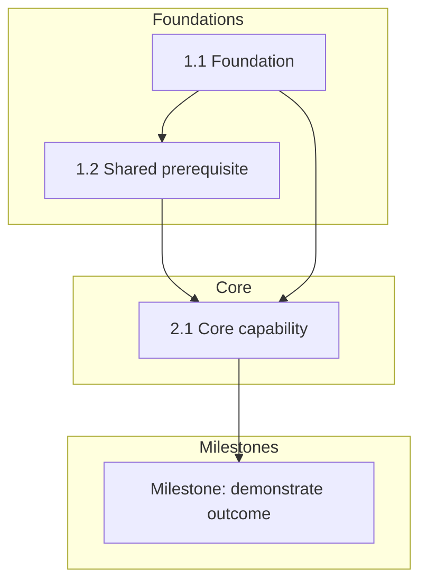

# Optional Mermaid DAG View

Use only when the user requests a visual dependency graph, when cross-branch edges are numerous, or when a renderer supports Mermaid. Keep the indented learning map as the authoritative readable structure.

## Rendering rules

Use stable node IDs that match the learning-map identifiers. Show only important prerequisite, reinforcement, alternative, parallel, and milestone edges; do not render every leaf when the graph becomes unreadable. Label alternative paths explicitly and keep sensitive or operational details out of the diagram unless the user requests them.
